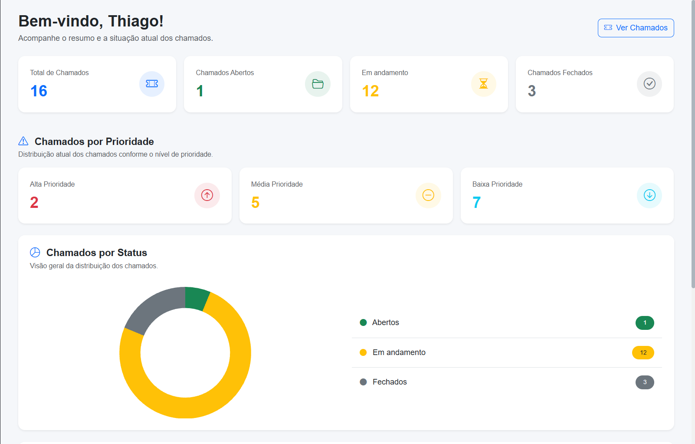
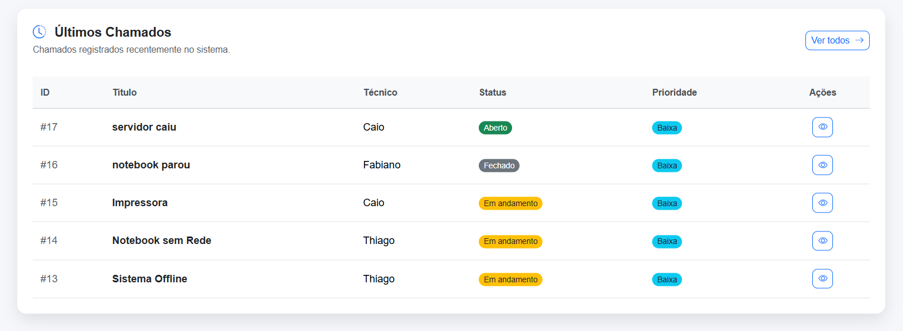
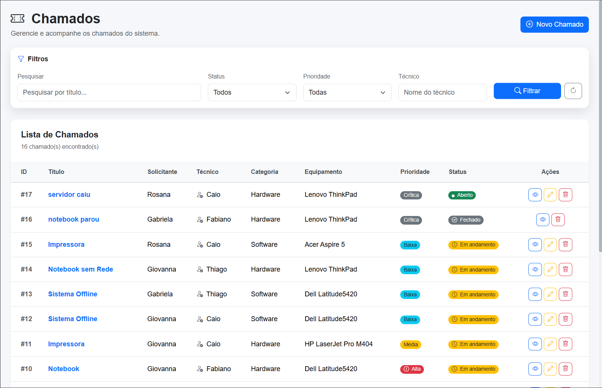
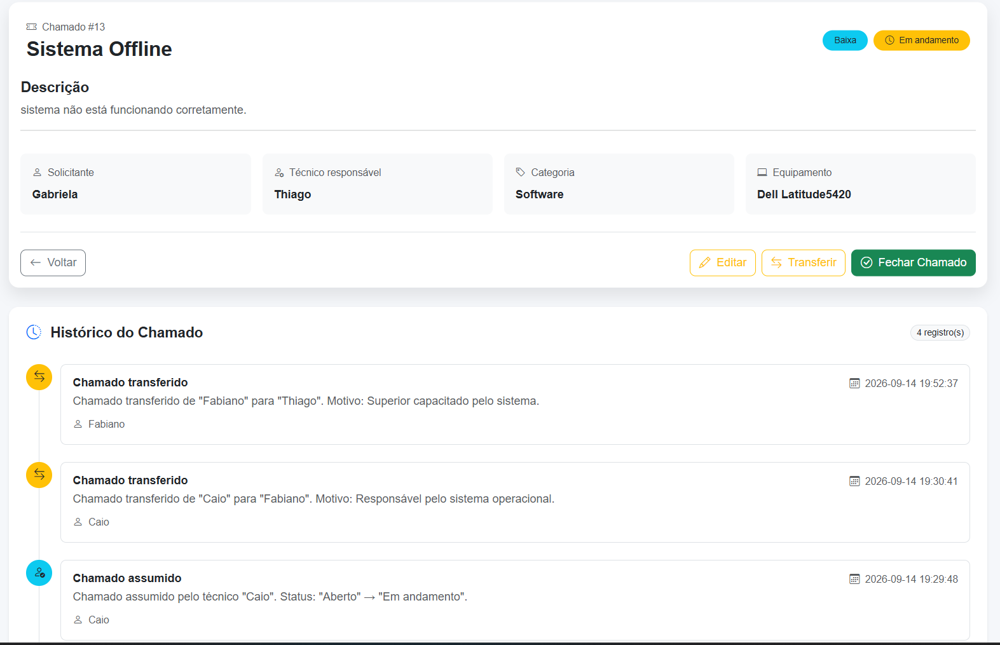
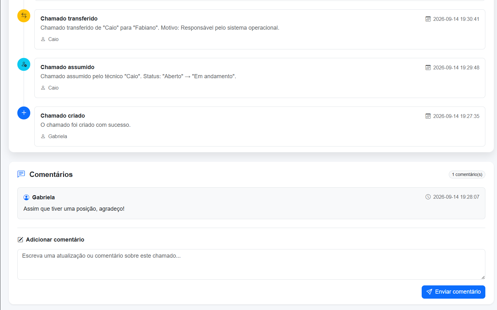
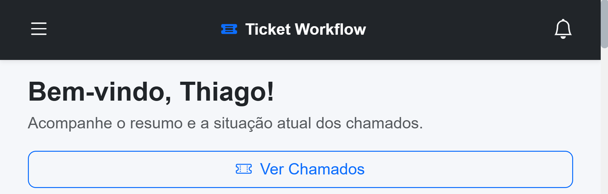
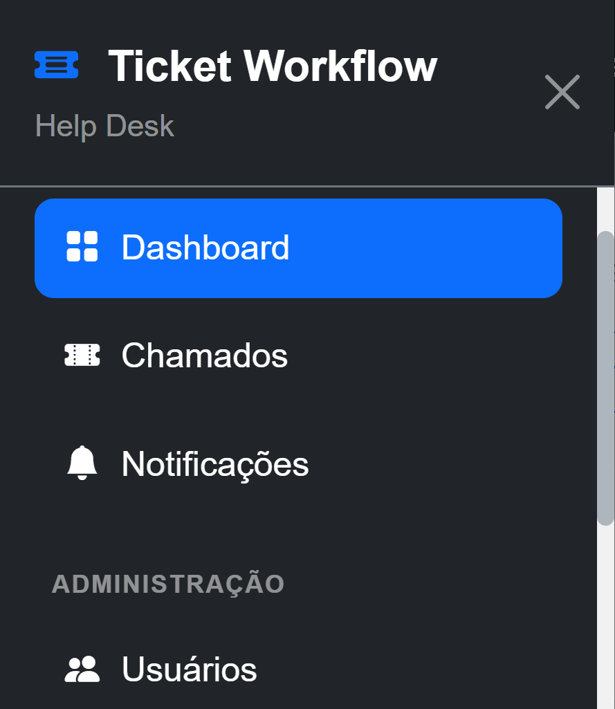

# 🎫 Ticket Workflow


Sistema web para **gerenciamento de chamados e ativos de TI**, desenvolvido com Python, Flask e MySQL.

O **Ticket Workflow** foi criado para organizar o fluxo de atendimento de suporte técnico, permitindo o acompanhamento completo de um chamado desde sua abertura até o encerramento, com controle de usuários, técnicos responsáveis, prioridades, histórico, comentários e notificações.

---

## 📌 Sobre o projeto

O Ticket Workflow simula um ambiente real de **Help Desk / Service Desk**, centralizando o gerenciamento de solicitações de suporte de TI.

O sistema trabalha com diferentes níveis de acesso e regras de negócio para garantir que cada usuário execute somente as operações permitidas pelo seu perfil.

O fluxo principal de atendimento é:

```text
Aberto → Em andamento → Fechado
                         ↓
                      Reaberto
                         ↓
                   Em andamento
```

Quando um chamado fechado é reaberto, ele retorna para o status **Em andamento**, permitindo a continuidade do atendimento.

---

## ✨ Funcionalidades

- 🔐 Autenticação de usuários
- 👥 Controle de acesso por perfil
- 🎫 Abertura e gerenciamento de chamados
- 👨‍💻 Atribuição de técnico responsável
- ✅ Assunção de chamados pelo técnico
- 🔄 Transferência entre técnicos
- ✏️ Edição de chamados
- 💬 Comentários nos chamados
- 📜 Histórico de ações
- 🔔 Sistema de notificações
- 🚨 Controle de prioridades
- 🖥️ Associação de equipamentos aos chamados
- ✅ Encerramento com registro obrigatório da solução
- 🔁 Reabertura de chamados
- 🗑️ Exclusão controlada por Administrador
- 📊 Dashboard com indicadores
- 📈 Gráfico de chamados por status
- 📱 Interface responsiva para desktop e dispositivos móveis

---

## 👥 Perfis de acesso

O sistema possui três perfis principais.

### 👤 Usuário

Responsável por solicitar atendimento.

Pode:

- Criar chamados
- Visualizar seus próprios chamados
- Acompanhar o andamento
- Adicionar comentários enquanto o chamado estiver aberto
- Consultar o histórico
- Receber notificações
- Reabrir seus próprios chamados fechados

Não pode executar ações administrativas ou assumir chamados.

### 👨‍💻 Técnico

Responsável pelo atendimento dos chamados.

Pode:

- Visualizar chamados
- Assumir chamados atribuídos a ele
- Atualizar informações do atendimento
- Adicionar comentários
- Transferir chamados
- Registrar a solução
- Encerrar chamados
- Reabrir chamados quando permitido
- Consultar o histórico

Um técnico não pode assumir um chamado que já esteja atribuído a outro técnico.

### 🛡️ Administrador

Possui as funcionalidades operacionais de um técnico e também permissões administrativas.

Pode:

- Gerenciar usuários
- Atuar nos chamados
- Assumir chamados
- Editar chamados
- Transferir chamados
- Encerrar e reabrir chamados
- Excluir chamados

---

## 🔄 Fluxo de atendimento

### 1. Abertura

O usuário registra uma solicitação informando:

- Título
- Descrição
- Categoria
- Prioridade
- Equipamento
- Técnico responsável

O chamado é criado com status:

```text
Aberto
```

### 2. Assumir chamado

O técnico responsável assume o atendimento.

```text
Aberto → Em andamento
```

A ação é registrada no histórico e o solicitante é notificado.

### 3. Transferência

Durante o atendimento, o chamado pode ser transferido para outro técnico autorizado.

A transferência fica registrada no histórico do chamado.

### 4. Encerramento

Um chamado somente pode ser encerrado quando estiver:

```text
Em andamento
```

O técnico precisa registrar obrigatoriamente a solução aplicada.

Depois:

```text
Em andamento → Fechado
```

A data de fechamento é registrada e o solicitante recebe uma notificação.

### 5. Reabertura

Um chamado fechado pode ser reaberto quando o atendimento precisar continuar.

É obrigatório informar o motivo da reabertura.

```text
Fechado → Em andamento
```

A reabertura também fica registrada no histórico.

---

## 🔒 Regras de negócio

Algumas das principais regras implementadas no sistema:

- Apenas usuários autenticados podem acessar o sistema
- Usuários comuns visualizam somente seus próprios chamados
- Técnicos não podem abrir chamados
- Apenas Técnicos e Administradores podem assumir chamados
- Um chamado possui apenas um técnico responsável
- Um técnico não pode assumir um chamado atribuído a outro técnico
- A troca do responsável deve ocorrer através do fluxo de transferência
- Um chamado fechado não pode ser editado ou transferido
- Apenas chamados em andamento podem ser encerrados
- O encerramento exige o registro de uma solução
- A reabertura exige um motivo
- Comentários não podem ser adicionados após o fechamento
- Apenas Administradores podem excluir chamados
- Alterações importantes são registradas no histórico

---

## 📊 Dashboard

O Dashboard apresenta uma visão geral do ambiente, incluindo:

- Total de chamados
- Chamados abertos
- Chamados em andamento
- Chamados fechados
- Chamados de prioridade alta
- Chamados de prioridade média
- Chamados de prioridade baixa
- Distribuição dos chamados por status
- Últimos chamados registrados

O gráfico de status é apresentado utilizando **Chart.js**.

---

## 🛠️ Tecnologias utilizadas

### Backend

- Python
- Flask 3.1
- Jinja2

### Banco de dados

- MySQL
- mysql-connector-python

### Frontend

- HTML5
- CSS3
- Bootstrap 5
- Bootstrap Icons
- JavaScript
- Chart.js

### Ferramentas

- Git
- GitHub
- VS Code

---

## 🏗️ Arquitetura

O projeto utiliza separação de responsabilidades entre rotas, modelos, templates e arquivos estáticos.

Exemplo da organização:

```text
TicketWorkflow/
│
├── database/
│
├── diagramas/
│
├── docs/
│   ├── images/
│   ├── 01-visao-geral.md
│   ├── 02-requisitos-funcionais.md
│   ├── 03-regras-de-negocio.md
│   └── 04-casos-de-uso.md
│
├── models/
│   ├── categoria.py
│   ├── chamado.py
│   ├── comentario.py
│   ├── equipamento.py
│   ├── historico.py
│   ├── notificacao.py
│   ├── prioridade.py
│   └── usuario.py
│
├── routes/
│   ├── auth.py
│   ├── chamados.py
│   ├── home.py
│   ├── notificacoes.py
│   └── usuarios.py
│
├── static/
│   └── css/
│       └── style.css
│
├── templates/
│   ├── components/
│   ├── layouts/
│   └── ...
│
├── .gitignore
├── app.py
├── config.py
├── requirements.txt
├── README.md
└── LICENSE
```

---

## ⚙️ Instalação

### 1. Clone o repositório

```bash
git clone https://github.com/thiiigomes/TicketWorkflow.git
```

Entre na pasta:

```bash
cd TicketWorkflow
```

### 2. Crie um ambiente virtual

No Windows:

```bash
python -m venv venv
```

Ative o ambiente:

```bash
venv\Scripts\activate
```

### 3. Instale as dependências

```bash
pip install -r requirements.txt
```

Principais dependências utilizadas:

```text
Flask
Jinja2
mysql-connector-python
python-dotenv
Werkzeug
```

---

## 🔐 Variáveis de ambiente

As informações sensíveis da aplicação são armazenadas em variáveis de ambiente e não são versionadas no Git.

Crie um arquivo `.env` na raiz do projeto:

```env
SECRET_KEY=sua_chave_secreta
DB_HOST=localhost
DB_PORT=3306
DB_USER=root
DB_PASSWORD=sua_senha
DB_NAME=ticket_workflow
```

> ⚠️ Nunca publique o arquivo `.env` ou credenciais reais no repositório.

---

## 🗄️ Banco de dados

O projeto utiliza **MySQL** para persistência dos dados.

Antes de executar a aplicação, é necessário:

1. Ter o MySQL instalado e em execução
2. Criar/configurar o banco utilizado pelo projeto
3. Configurar a conexão através do arquivo `.env`
4. Criar as tabelas necessárias para o funcionamento do sistema

Os arquivos relacionados à estrutura do banco estão disponíveis na pasta:

```text
database/
```

---

## ▶️ Executando o projeto

Com o ambiente virtual ativado, as dependências instaladas, as variáveis de ambiente configuradas e o banco MySQL disponível, execute:

```bash
python app.py
```

Depois, acesse no navegador o endereço informado pelo Flask no terminal.

---

## 📸 Screenshots

### 📊 Dashboard

Visão geral dos chamados, indicadores por status e prioridade e acompanhamento da situação atual dos atendimentos.





---

### 🎫 Gerenciamento de Chamados

Listagem centralizada dos chamados com filtros por status, prioridade e técnico, além das ações disponíveis conforme o perfil do usuário.



---

### 🔎 Detalhes e Histórico do Chamado

Visualização completa das informações do chamado, técnico responsável, ações disponíveis e histórico das movimentações realizadas.



O sistema mantém o histórico das ações e também permite a comunicação entre solicitantes e equipe técnica através de comentários.



---

### 📱 Interface Responsiva

A aplicação possui interface adaptada para dispositivos móveis, incluindo navegação específica para telas menores.





---

## 🚀 Melhorias futuras

Algumas funcionalidades que podem ser implementadas futuramente:

- Controle de SLA
- Relatórios gerenciais
- Filtros e indicadores avançados
- Pesquisa avançada de chamados
- Recuperação de senha
- Envio de notificações por e-mail
- API REST
- Testes automatizados
- Deploy em ambiente de produção

---

## 🎯 Objetivo do projeto

O Ticket Workflow foi desenvolvido como projeto prático para aplicar conceitos de:

- Desenvolvimento web com Flask
- Programação em Python
- Banco de dados relacional
- Modelagem de regras de negócio
- Autenticação e autorização
- Controle de permissões
- CRUD
- Segurança no backend
- Responsividade
- Versionamento com Git e GitHub

Além da implementação técnica, o projeto busca representar situações encontradas em ambientes reais de suporte e gerenciamento de serviços de TI.

---

## 👨‍💻 Autor

**Thiago Gomes Magalhães**

Estudante de Análise e Desenvolvimento de Sistemas, com experiência na área de Tecnologia da Informação e foco em desenvolvimento de software.

GitHub: **@thiiigomes**

---

## 📄 Status do projeto

🟢 **Versão funcional disponível**

As principais funcionalidades do fluxo de chamados estão implementadas e validadas.